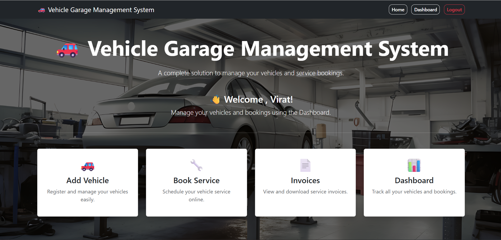
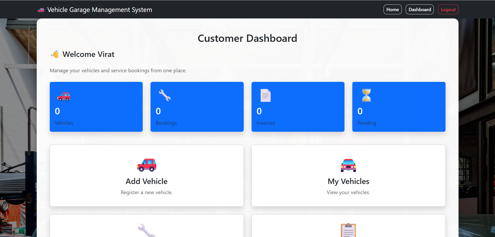
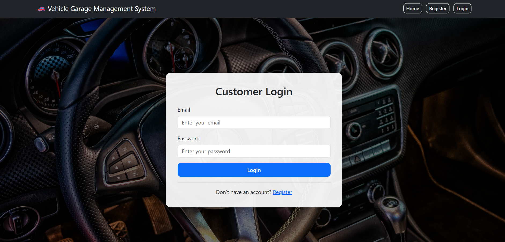
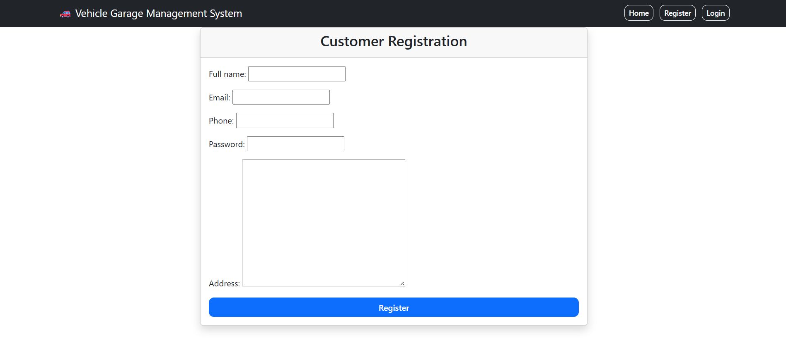

# 🚗 Vehicle Garage Management System

A web-based Vehicle Garage Management System developed using Django that allows customers to register, manage their vehicles, book vehicle services, and download invoices.

---

## 📌 Features

- 👤 Customer Registration & Login
- 🔐 Session-based Authentication
- 🚗 Add, Edit & Delete Vehicles
- 📋 View Registered Vehicles
- 🔧 Book Vehicle Services
- 🧾 Generate Service Invoice
- 📅 View Booking History
- 💬 Success Messages
- 🖼️ Beautiful Responsive UI
- 🛠️ Django Admin Panel

---

## 🛠️ Technologies Used

- Python
- Django
- HTML5
- CSS3
- Bootstrap 5
- SQLite3
- Git
- GitHub

---

## 📂 Project Structure

```
vehicle_garage_system/
│
├── accounts/
├── bookings/
├── vehicles/
├── static/
│   ├── css/
│   └── images/
├── templates/
├── manage.py
├── db.sqlite3
└── README.md
```

---

## 🚀 Installation

Clone the repository

```bash
git clone https://github.com/Madesh-ux/vehicle-garage-management-system.git
```

Go to the project folder

```bash
cd vehicle-garage-management-system
```

Create Virtual Environment

```bash
python -m venv .venv
```

Activate Virtual Environment

Windows

```bash
.venv\Scripts\activate
```

Install Dependencies

```bash
pip install django
```

Run the server

```bash
python manage.py runserver
```

Open

```
http://127.0.0.1:8000
```

---

## 🔮 Future Enhancements

- Online Payment Gateway
- Email Notifications
- Service Reminders
- Vehicle Image Upload
- Service History Reports
- PDF Invoice Download

## 📸 Screenshots

### Home Page



### Dashboard



### Login



### Register

### Admin Panel


---

## 👨‍💻 Author

**Madesh S**

GitHub:
https://github.com/Madesh-ux

---

⭐ If you like this project, don't forget to star the repository.